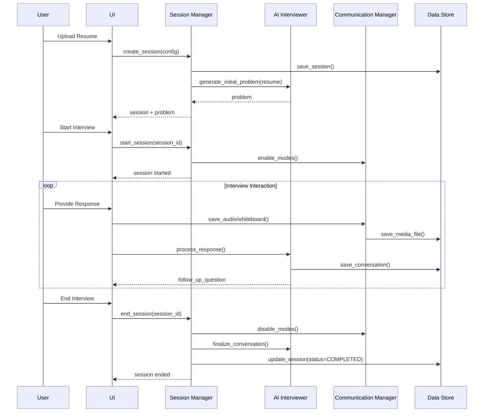

# Architecture Documentation

## Overview

The AI Mock Interview Platform is a local proof-of-concept system designed to help candidates practice system design interviews with an AI interviewer. The architecture follows SOLID principles, uses dependency injection, and implements the repository pattern for data access.

## System Architecture

### High-Level Architecture

```
┌─────────────────────────────────────────────────────────────────┐
│                         User Interface                           │
│                      (Streamlit Web App)                         │
└────────────────────────────┬────────────────────────────────────┘
                             │
┌────────────────────────────┴────────────────────────────────────┐
│                      Application Layer                           │
│  ┌──────────────┐  ┌──────────────┐  ┌──────────────┐         │
│  │   Session    │  │     AI       │  │  Evaluation  │         │
│  │   Manager    │  │ Interviewer  │  │   Manager    │         │
│  └──────────────┘  └──────────────┘  └──────────────┘         │
│                                                                  │
│  ┌──────────────┐  ┌──────────────┐  ┌──────────────┐         │
│  │Communication │  │    Resume    │  │    Token     │         │
│  │   Manager    │  │   Manager    │  │   Tracker    │         │
│  └──────────────┘  └──────────────┘  └──────────────┘         │
└────────────────────────────┬────────────────────────────────────┘
                             │
┌────────────────────────────┴────────────────────────────────────┐
│                    Infrastructure Layer                          │
│  ┌──────────────┐  ┌──────────────┐  ┌──────────────┐         │
│  │  PostgreSQL  │  │     File     │  │   Logging    │         │
│  │  Data Store  │  │   Storage    │  │   Manager    │         │
│  └──────────────┘  └──────────────┘  └──────────────┘         │
└──────────────────────────────────────────────────────────────────┘
```

## Design Principles

### SOLID Principles

The platform implements all five SOLID principles:

1. **Single Responsibility**: Each component has one clear purpose
2. **Open-Closed**: Extend through inheritance, not modification
3. **Liskov Substitution**: Interfaces are interchangeable
4. **Interface Segregation**: Focused, minimal interfaces
5. **Dependency Inversion**: Depend on abstractions, not concretions

### Additional Patterns

- **Repository Pattern**: Abstracts data access
- **Factory Pattern**: Creates complex objects
- **Strategy Pattern**: Selects algorithms at runtime
- **Dependency Injection**: All dependencies injected through constructors

## Key Components

### Session Manager

Orchestrates the interview lifecycle and coordinates between components.

**Responsibilities:**
- Create and configure interview sessions
- Start and end sessions
- Manage session state transitions
- Coordinate between components

### AI Interviewer

Generates interview questions and analyzes candidate responses using LLMs.

**Responsibilities:**
- Generate initial interview problem based on resume
- Analyze candidate responses
- Generate follow-up questions
- Maintain conversation context
- Track token usage

### Communication Manager

Handles multi-modal communication (audio, video, whiteboard, screen share).

**Responsibilities:**
- Enable/disable communication modes
- Coordinate between mode-specific handlers
- Store media files
- Manage transcription

### Evaluation Manager

Analyzes interview performance and generates comprehensive feedback.

**Responsibilities:**
- Analyze conversation quality
- Evaluate system design approach
- Generate competency scores
- Create improvement plans

### Data Store

Manages data persistence using PostgreSQL.

**Responsibilities:**
- CRUD operations for all entities
- Query optimization
- Transaction management
- Connection pooling

## Data Flow

### Interview Session Flow



## Architecture Decision Records

### ADR-001: Use PostgreSQL for Data Storage

**Status**: Accepted

**Rationale:**
- ACID compliance ensures data integrity
- Relational model fits structured interview data
- JSON support for flexible metadata
- Easy local deployment in Docker
- Clear migration path to cloud PostgreSQL

### ADR-002: Use Dependency Injection

**Status**: Accepted

**Rationale:**
- Highly testable code with easy mocking
- Can swap implementations without code changes
- Clear, explicit dependencies
- No framework overhead

### ADR-003: Use Repository Pattern

**Status**: Accepted

**Rationale:**
- Abstracts data access for future cloud migration
- Easy to create in-memory implementations for tests
- Separates business logic from data access
- Enables swapping PostgreSQL for other databases

### ADR-004: Use LangChain for LLM Orchestration

**Status**: Accepted

**Rationale:**
- Multi-provider support (OpenAI, Anthropic)
- Built-in conversation memory
- Structured prompt templates
- Token tracking included

### ADR-005: Use Streamlit for UI

**Status**: Accepted

**Rationale:**
- Rapid development with pure Python
- Built-in interactive components
- WebRTC and canvas support
- Perfect for proof-of-concept

## Future Considerations

### Scalability

- Multi-user support with authentication
- Cloud deployment (AWS/GCP/Azure)
- Horizontal scaling with load balancing
- Redis caching for session state
- CDN for media file delivery

### Performance

- Async processing for I/O operations
- Background jobs for evaluation generation
- Streaming LLM responses
- Database query optimization

### Features

- Multiple interview types (coding, behavioral)
- Real-time collaboration
- Analytics dashboard
- Mobile support
- Integration with job boards

---

For detailed component documentation, see the [Components](components/session-manager.md) section.
